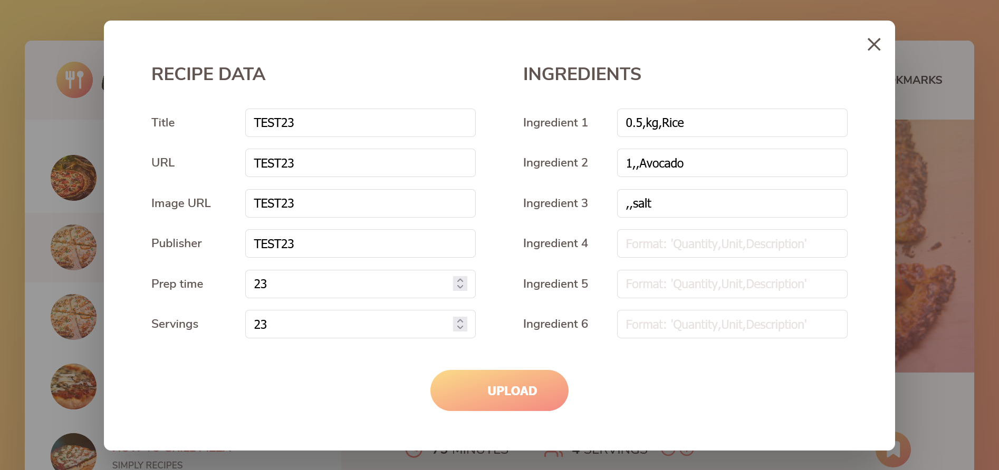
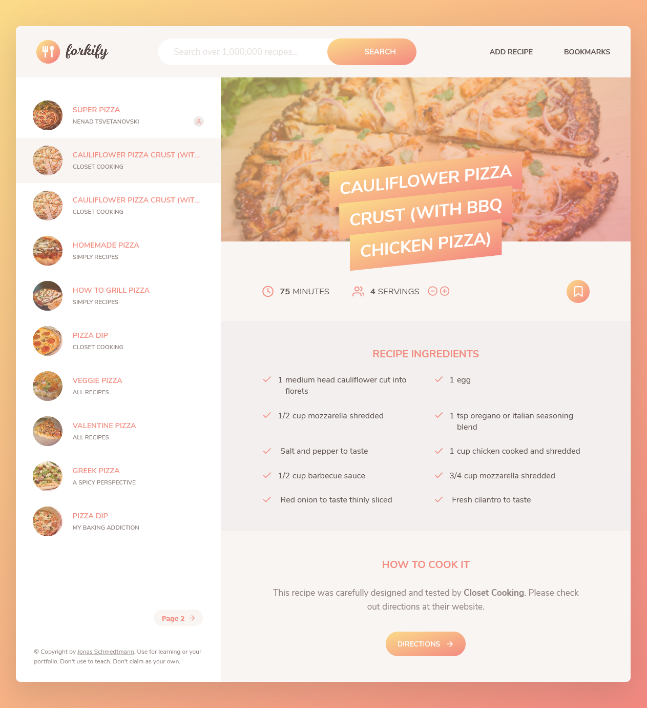

## Table of contents

- [Overview](#overview)
  - [The challenge](#the-challenge)
  - [Screenshot](#screenshot)
  - [Links](#links)
- [My process](#my-process)
  - [Built with](#built-with)
- [Author](#author)

## Overview

Food recipe app with option to create your own recipe and save bookmarks. The data for the recipes are from the forkify api (https://forkify-api.herokuapp.com/)

Users should be able to:

- Search for food recipes
- Bookmark favourite recipes and go back to them anytime they want
- Create your own recipes
- Go to the original website and view the whole recipe and cooking instructions

### Screenshot

### Links

- GitHub URL: https://github.com/Nesh00/forkify-app
- Live Site URL: https://forkify-app-nenad.netlify.app/#5ed6604591c37cdc054bcd09

## My process

### Built with

- Semantic HTML5 markup
- CSS Grid
- CSS Flex
- Sass
- JavaScript
- npm
- MVC Architecture
- Babel
- Parcel

## Author

- LinkedIn - https://www.linkedin.com/in/nenad-tsvetanovski-3101b474/
- Twitter - https://twitter.com/nenad37452460
